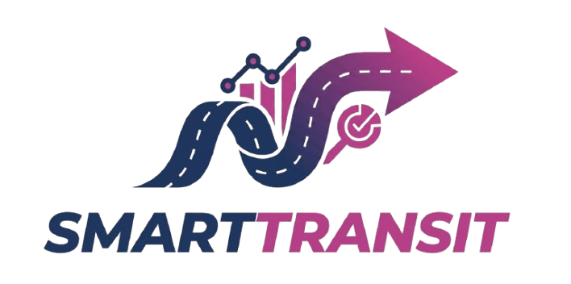

# 🚌 SmartTransit OS — Smart City Public Transport Operating System

<div align="center">



**Next-Generation Municipal Transit Operations, Real-Time Fleet Telemetry & AI Predictive Platform**

[](https://smarttransit-os.vercel.app/)
[](documentation/index.html)
[](https://github.com/Raccoon-UX/smarttransit-os)
[](LICENSE)
[]()

[🌐 Live Web Portal](https://smarttransit-os.vercel.app/) • [📖 Technical Documentation](documentation/index.html) • [🐙 GitHub Repo](https://github.com/Raccoon-UX/smarttransit-os)

</div>

---

## 🏛️ Executive Summary

**SmartTransit OS** is an institutional-grade, multi-role public transportation operating system built for municipal transit corporations (such as MSRTC, BEST, and TMT). It unites live GPS bus tracking, multi-modal commuter trip planning, in-vehicle driver telemetry navigation, operational dispatch control, and System Operations Center (SOC) infrastructure monitoring into a single, high-performance web application.

---

## 👥 4 Specialized Role Portals

SmartTransit OS provides dedicated, role-based workflows for all municipal transit stakeholders:

| Role | Persona | Key Capabilities | Accessible Routes |
| :--- | :--- | :--- | :--- |
| 👤 **Passenger** | Aarav Sharma *(Daily Metro Commuter)* | Live Bus Search, Journey Planner, Bus Stop Digital Kiosks, Active Trip Tracker, Crowding Forecaster, Marathi/English localization. | `/passenger/*` |
| 👨‍✈️ **Driver** | Vikram Jadhav *(Senior Bus Pilot)* | Turn-by-Turn GPS Waypoint Navigation, Live Vehicle Occupancy Reporter, Shift Timetables, Multi-Channel SOS Broadcast. | `/driver/*` |
| 👩‍💼 **Transport Admin** | Priya Nambiar *(Chief Dispatch Officer)* | Municipal Fleet Roster, Driver Assignment Modals, Route Control, Schedule Dispatcher, Demand Surge Analytics. | `/admin/*` |
| 👨‍💻 **System Ops (SOC)** | Devraj Sen *(SOC Infrastructure Engineer)* | Infrastructure Telemetry, AI Model Latency Center, GPS Signal Dropout Monitor, Database Backups, RBAC Keys. | `/soc/*` |

---

## 🚨 Multi-Channel Emergency SOS & Grievance Dispatch

The driver cockpit and public portal include a 3-way incident dispatch system connected directly to municipal authorities:

- 💬 **WhatsApp Incident Dispatch**: Automatically generates structured emergency and grievance payloads to `+91 7710893839`.
- 📧 **Gmail SOS Dispatch**: Opens prefilled incident reporting emails to `vsujal956@gmail.com`.
- 📞 **Toll-Free Helpline**: Integrated with municipal helpline `1800-11-TRANSIT`.

---

## 🧠 AI Predictive Intelligence Engine (ST-70)

The centralized heuristic AI engine (`src/services/ai/aiEngine.js`) delivers sub-40ms intelligence:

- **Predictive ETA**: Real-time arrival time inference based on corridor congestion scores and historical dwell times.
- **Occupancy Forecasting**: Evaluates bus passenger loads and predicts crowding levels before arrival.
- **Demand Surge Heatmaps**: Identifies high-density transit corridors to suggest auxiliary feeder bus dispatches.
- **Anomaly Detection**: Flags GPS signal dropouts, route deviations, and unscheduled vehicle stops.
- **AIDemoControls**: Interactive simulator bar to test crowd surges, delays, and emergency scenarios on the fly.

---

## 🛠️ Technology Stack

- **Core Framework**: React 18 with Vite 6
- **Styling Architecture**: Tailwind CSS 3.4 + Custom Tokens (`src/index.css`)
- **Routing & RBAC**: React Router with `React.lazy` Suspense code-splitting and `ProtectedRoute` guard
- **Icons & Visuals**: Lucide React + Official Vector Emblems (MSRTC, BEST, TMT)
- **Data Protocols**: GTFS-RT v2.0 Schemas + GeoJSON Corridors
- **State Management**: `AuthContext`, `ThemeContext`, `PublicAccessibilityContext`

---

## 📁 Repository Structure

```text
smarttransit-os/
├── documentation/                   # Master Technical Documentation Portal
│   ├── index.html                   # Interactive 18-Chapter Documentation Web App
│   ├── styles.css                   # Documentation Custom Stylesheet & Print CSS
│   ├── app.js                       # Search (Ctrl+K), Reading Progress, Lightbox
│   ├── DOCUMENTATION.md             # Master Markdown Manual
│   ├── README.md                    # Documentation Folder Specific Guide
│   └── img/                         # Screenshots, Emblems & Visual Assets
├── src/                             # Main SmartTransit OS React Application
│   ├── assets/                      # Application Brand & Vehicle Assets
│   ├── components/
│   │   ├── navigation/              # AppSidebar, NavContainer, RoleSwitcher
│   │   ├── profile/                 # UserProfileDrawer, Preferences, Security
│   │   ├── public/                  # PublicNavbar, PublicFooter, Grievance Desk
│   │   ├── system/                  # SmartTransitLoader, LiveSystemIndicator
│   │   └── ui/                      # UserAvatar, Button, Modal, Drawer, Badge
│   ├── context/
│   │   ├── AuthContext.jsx          # Role authentication & persona switcher
│   │   ├── ThemeContext.jsx         # Dark/Light theme token state
│   │   └── PublicAccessibilityContext.jsx # Marathi / English & font scaling
│   ├── layouts/
│   │   ├── AppHeader.jsx            # Top government masthead header
│   │   ├── AppShell.jsx             # Main application layout wrapper
│   │   └── PublicLayout.jsx         # Public landing page layout
│   ├── modules/
│   │   ├── admin/                   # Fleet, Drivers, Routes, Schedules, Analytics
│   │   ├── ai/                      # AI Intelligence Center, Simulation Controls
│   │   ├── driver/                  # Navigation, Occupancy, Emergency SOS
│   │   ├── passenger/               # Live Map, Search, Trip Planner, Stops
│   │   └── soc/                     # Telemetry Engine, Backups, Security
│   ├── routes/
│   │   ├── AppRouter.jsx            # Code-split route definitions
│   │   └── ProtectedRoute.jsx       # RBAC authorization barrier
│   └── services/                    # Telemetry, Incident, Fleet, AI Services
├── index.html                       # Application HTML entry point
├── package.json                     # Dependencies and scripts
└── vite.config.js                   # Vite configuration
```

---

## 🚀 Getting Started Locally

### Prerequisites
- Node.js (v18.0 or later recommended)
- npm or yarn

### Installation & Setup

1. **Clone the repository**:
   ```bash
   git clone https://github.com/Raccoon-UX/smarttransit-os.git
   cd smarttransit-os
   ```

2. **Install dependencies**:
   ```bash
   npm install
   ```

3. **Start the local development server**:
   ```bash
   npm run dev
   ```
   Open [http://localhost:5173/](http://localhost:5173/) to explore the main application, or [http://localhost:5173/documentation/index.html](http://localhost:5173/documentation/index.html) for the technical documentation portal.

4. **Build for production**:
   ```bash
   npm run build
   ```

---

## 🚩 Milestone Trajectory (ST-01 → ST-80)

- **ST-01 → ST-10**: Core Design Tokens, AppShell, Government Masthead Header, Responsive Sidebar.
- **ST-11 → ST-20**: Centralized RBAC, RoleSwitcher, ProtectedRoute, Multi-Role Personas.
- **ST-21 → ST-30**: Passenger Commuter Portal, Live Bus Search, Journey Planner, Active Trip Card.
- **ST-31 → ST-40**: Transport Admin Console, Fleet Management, Driver Assignment Modals, Timetables.
- **ST-41 → ST-50**: System Operations Center (SOC), Telemetry Stream, Infrastructure Monitor.
- **ST-51 → ST-60**: AI Intelligence Center, Predictive ETAs, Occupancy Forecasting, Anomaly Triggers.
- **ST-61 → ST-70**: Emergency SOS Multi-Channel Dispatch (WhatsApp & Gmail), Marathi Localization.
- **ST-71 → ST-80**: Bundle Code-Splitting (455.85 kB initial JS chunk), UserAvatar Vector Graphics, Profile Drawers, and Master Interactive Documentation Portal.

---

## 📄 License & Disclaimer

SmartTransit OS is open source under the [MIT License](LICENSE). Built for municipal public transit modernization.
